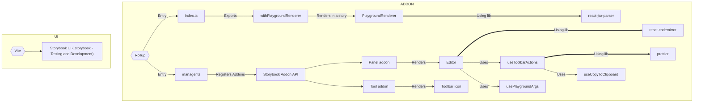

# Storybook Addon Playground


## Develop locally

Install dependencies and start

```bash
npm i
npm start
```

Go to [localhost:6006](http://localhost:6006)

## How to add to your Storybook project

### Install

```bash
npm install -D storybook-addon-playground
```

### Register addon

On your `.storybook/main.ts` file, add the following:

```js
const config = {
  ...
  addons: [
    ...
    "storybook-addon-playground",
  ],
};
```

### Load custom components and set Playground story

On your `.storybook/preview.ts` file, add the following:

```js
...
import MyComponentsLibrary from 'my-components-library';
import MyIconsLibrary from 'my-icons-library';
...
const preview = {
  ...
  parameters: {
    playground: {
      // title of your story (including category prefix, if there is one)
      storyId: "playground",
      components: { ...MyComponentsLibrary, ...MyIconsLibrary },
      editorTheme: "light", // optional - set this to override your storybook's theme
      introCode: { jsx: `<div>Welcome to my Playground!</div>`, css: "" }, // optional - set this to introdoce a "welcome" code example
    },
  },
};
```

### Render a story including the playground in the sidebar

Create a story with the following content:

```js
import { withPlaygroundRenderer } from "../../src/decorators";

export default {
  title: "Playground",
  decorators: [withPlaygroundRenderer],
};

export const Playground = {};
```

## Build

### Vite

Vite is used to build the local Storybook for testing and dev purposes

### Rollup

Rollup is used to build the addon for publishing


