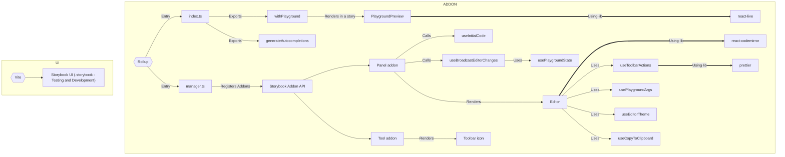

# Storybook Addon Playground


## Develop locally

Install dependencies and start

```bash
yarn
yarn start
```

Or

```bash
npm i
npm start
```

Go to [localhost:6006](http://localhost:6006)

## How to add to your Storybook project

### Install

```bash
yarn add -D storybook-addon-playground
```

Or

```bash
npm install -D storybook-addon-playground
```

### Register addon

On your `.storybook/main.ts` file, add the following:

```js
const config = {
  addons: [
    // rest of your addons ...
    "storybook-addon-playground",
  ],
};
```

### Addon Configuration

The addon configuration is done through Storybook's `preview`. Few of the parameters are required for the addon to work properly:

- `storyId`: **Required**. The story id that your playground has on Storybook.
- `components`: **Required**. An object with the components that should be rendered in the playground. The key is the component name and the value is the component itself.
- `autocompletions`: Optional. An array of autocompletions that should be used on the playground. Default is an empty array. We recommend on using `react-docgen` to generate a documentation output and run our util function on the output. You can use whatever tool you'd like as long as it matches the expected format in the addon. _Default is no autocompletions._
- `editorTheme`: Optional. The theme that should be used on the playground. _Default is your Storybook theme._
- `initialCode`: Optional. The initial code ("welcome") that should be rendered on the playground. _Default is empty editor._

On your `.storybook/preview.ts` file, you should add something similar to the following:

```ts
import MyComponentsLibrary from "my-components-library";
import MyIconsLibrary from "my-icons-library";
import reactDocgenOutput from "./react-docgen-output.json";
import { generateAutocompletions } from "storybook-addon-playground";

const preview = {
  parameters: {
    playground: {
      storyId: "playground",
      components: { ...MyComponentsLibrary, ...MyIconsLibrary },
      autocompletions: generateAutocompletions(reactDocgenOutput),
      editorTheme: "light",
      introCode: { jsx: `<div>Welcome to my Playground!</div>`, css: "" },
    },
  },
};
```

### Render a story including the playground in the sidebar

Create a story with the following content:

```js
import { withPlayground } from "storybook-addon-playground";

export default {
  title: "Playground",
  decorators: [withPlayground],
};

export const Playground = {};
```

## Build

### Vite

Vite is used to build the local Storybook for testing and dev purposes

### Rollup

Rollup is used to build the addon for publishing


