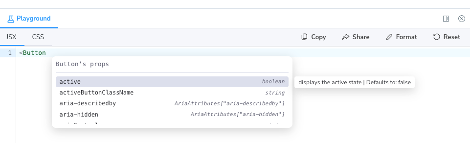

# Playground - Storybook Addon

This addon enhances your Storybook experience by allowing you to interactively play with your components. It's perfect for developers looking to experiment in real time, debug issues, or build complex compositions.



## Installation

To install the addon, run one of the following commands in your project directory:

```bash
yarn add -D storybook-addon-playground
# or
npm install -D storybook-addon-playground
```

## Configuration

Add the addon to your Storybook configuration in `.storybook/main.js` or `.storybook/main.ts`:

```js
const config = {
  addons: [
    // rest of your addons ...
    "storybook-addon-playground",
  ],
};
```

The addon configuration is done through Storybook's `preview` parameters.

| Parameter        | Required | Default                           | Description                                                                                                           |
|------------------|----------|-----------------------------------|-----------------------------------------------------------------------------------------------------------------------|
| `storyId`        | `true`   |                                   | The story id that your playground has on Storybook.                                                                   |
| `components`     | `true`   |                                   | An object with the components that should be rendered in the playground. The key is the component name and the value is the component itself. |
| `autocompletions`| `false`  | `[]`                              | An array of autocompletions that should be used on the playground. Recommended to use `react-docgen` for generating documentation outputs. |
| `editorTheme`    | `false`  | Your Storybook theme              | The theme that should be used on the playground.                                                                      |
| `initialCode`    | `false`  | Empty editor                      | The initial code ("welcome") that should be rendered on the playground.                                               |
| `share`          | `false`  | `false`                           | Whether to allow share capabilities.                                                                                  |

On your `.storybook/preview.ts` file, you should add something similar to the following:

```ts
import MyComponentsLibrary from "my-components-library";
import MyIconsLibrary from "my-icons-library";
import reactDocgenOutput from "./react-docgen-output.json";
import { generateAutocompletions } from "storybook-addon-playground";

const preview = {
  parameters: {
    playground: {
      storyId: "playground",
      components: { ...MyComponentsLibrary, ...MyIconsLibrary },
      autocompletions: generateAutocompletions(reactDocgenOutput),
      editorTheme: "light",
      introCode: { jsx: `<div>Welcome to my Playground!</div>`, css: "" },
    },
  },
};
```

Set up the playground environment in your Storybook stories:

```js
import { withPlayground } from "storybook-addon-playground";

export default {
  title: "Playground",
  decorators: [withPlayground],
};

export const Playground = {};
```

## Usage

To use the Playground, navigate to the Storybook UI and select a story that has the playground decorator. In your addons panel, see an interactive code editor alongside your component, where you can modify the code and immediately see your changes reflected.

## Contributing

Contributions are welcome! Feel free to open an issue or submit a pull request.

### Develop locally

Install dependencies and start

```bash
yarn
yarn start
```

Go to [localhost:6006](http://localhost:6006)

### Add new icons

Icons are generated using [svgr](https://react-svgr.com/docs/).

In order to add new icons to the addon, drop the icons somewhere in the repo and run the following command:

```bash
yarn build:icons path/to/your/icons
```

### Build

#### Rollup

Rollup is used to build the addon for publishing.

#### Vite

Vite serves the build to a local Storybook for testing and dev purposes.
